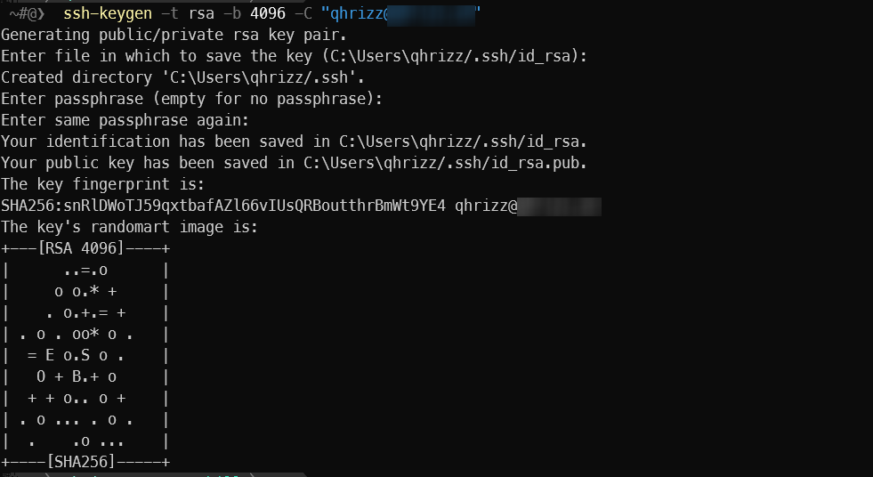

--- 
title: Setup SSH keys
parent: Setups
grand_parent: Linux
tags: ssh, keys, linux
--- 
# SSH Keys
https://www.atlassian.com/git/tutorials/git-ssh


```
SSH keys are generated through a public key cryptographic algorithm, the most common being RSA or DSA. 
At a very high level SSH keys are generated through a mathematical formula that takes 2 prime numbers and a random seed variable to output the public and private key. 
This is a one-way formula that ensures the public key can be derived from the private key but the private key cannot be derived from the public key.
``` 

You can consider the public key as the lock and private key as the "key" to unlock the lock. 


## Generate keypair

**Example**
```
ssh-keygen -t rsa -b 4096 -C "user@domain.com"
```



This will create two files, the **id_rsa** which is the private key and **id_rsa.pub** which is the public key. This is the key you want to share with other hosts. 

Add the public key to **.ssh/authorized_keys**

### Ubuntu
The public key would go into /home/USERNAME/.ssh/authorized_keys

